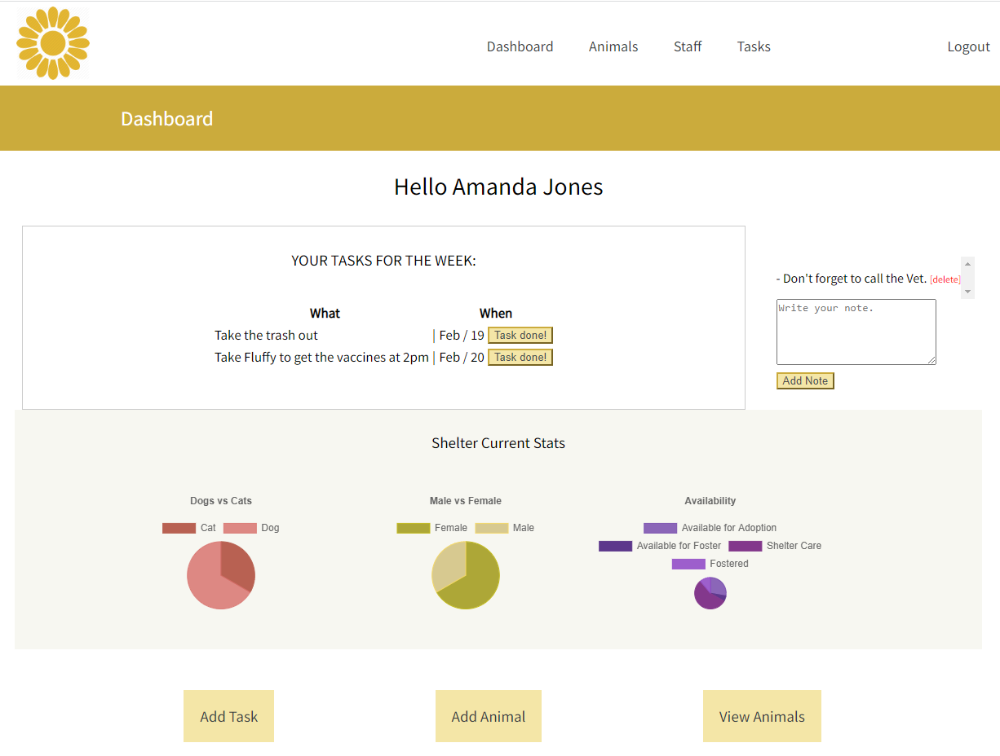
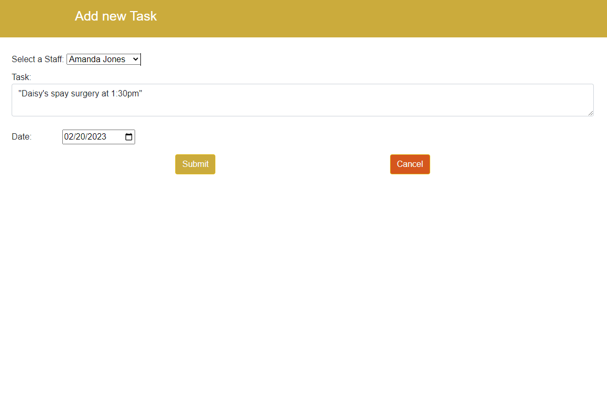
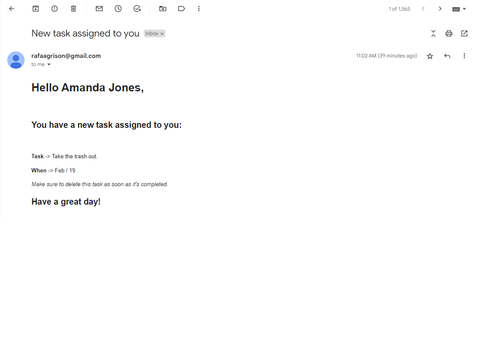
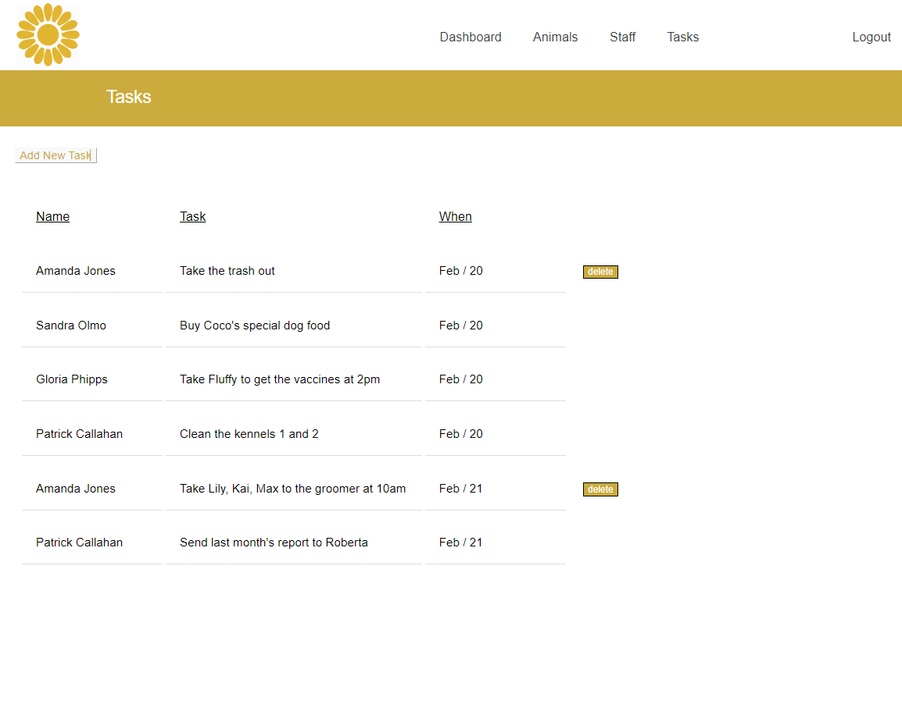
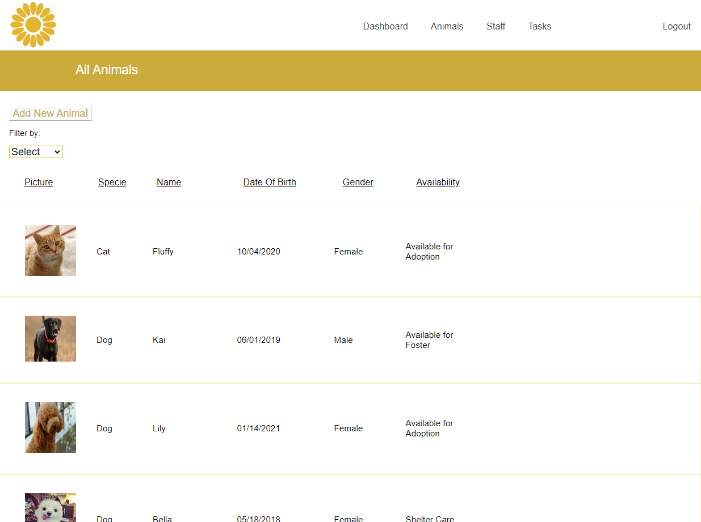
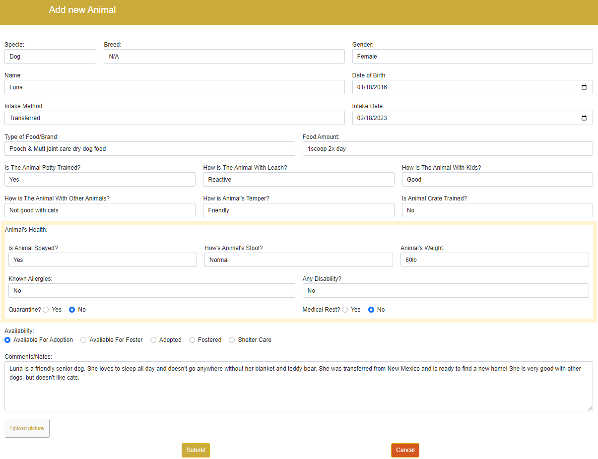
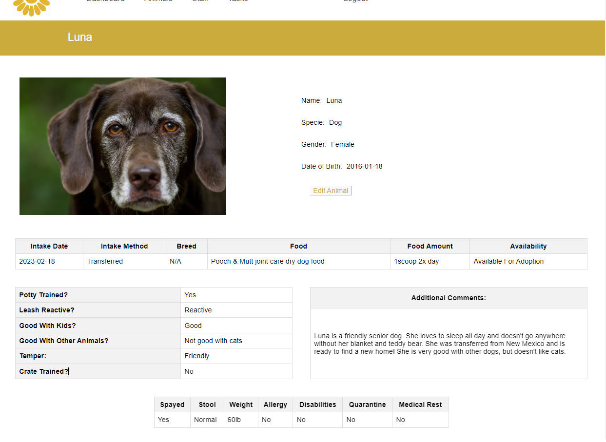
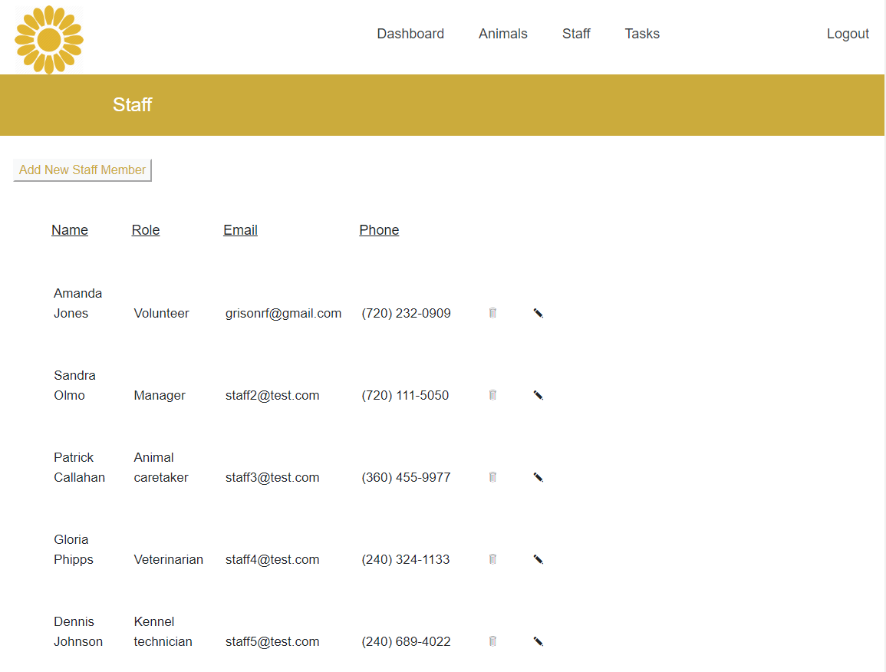

# Animal Shelter Management System
This app has been designed to help manage the day-to-day operations of an animal shelter, ensuring that animals are well-cared for, staff members are efficiently assigned tasks, and records are properly managed.

## Table of contents
* 🤖 [Technologies](#technologies-used)
* ⭐ [Features](#features)
* 🌸 [About Me](#about-me)

## Technologies Used
* Backend: Java, SpringBoot, Hibernate, PostgreSQL.
* Frontend: JavaScript, Thymeleaf, Bootstrap, HTML, CSS.
* APIs: Cloudinary API, Java Mail Sender.

## Features

### Dashboard
* User can see their pending tasks for the week, along with their deadline and a button to mark them as completed. 
* They can also see a list of notes with the option to delete and create new ones.
* Using Chart.js, current stats of the shelter are displayed, showing the number of animals, their species, and their availability.

### Tasks
* Clicking on "add task" allows the user to create a new task by picking the staff, task description, and the deadline.

* Whenever the task is created, the person assigned to it gets a notification on their email containing the important information about the task. Feature implemented using JavaMailSender.

* On the tasks page, the user can see all the pending tasks, and they can delete the task when it's complete, which is also updated on the user's dashboard.

### Animals
* JavaScript script fetches all the animals from a REST API and creates animal cards for each animal in the list.
* User can filter the animals based on species, gender, and availability.

* User can add a new animal filling up a form with all the relevant information about the new animal, including disposition and health. 
* Using Cloudinary API, the user can upload a picture of the animal.

* Using Thymeleaf as a template engine, user can see everything about any particular animal by clicking on its name.

### Staff
* On the staff page, the user can see the information about the staff, add new staff members, and delete them.

## About me

